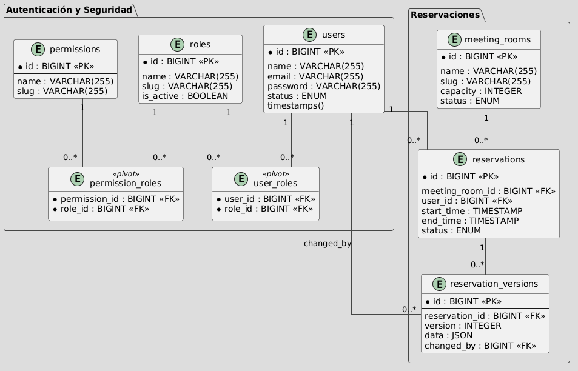

#📘 Sección 1: Teoría y Conceptos Avanzados (20%)
## 1.1 Service Container
Explica cómo funciona el Service Container de Laravel. ¿Qué diferencia hay entre bind, singleton e instance?
Da un ejemplo de uso con una interfaz y su implementación concreta.

### Respuesta 1.1
El Service Container de Laravel es el sistema encargado de gestionar la creación de objetos y sus dependencias; utilizando la inyección de dependencias, nos permite no tener que crear objetos manualmente con "new".
Para que Laravel logre esto, utiliza reflection, donde se pone a identificar las dependencias que se van a utilizar y las resuelve de forma recursiva hasta construir completamente el objeto solicitado.

Cuando la clase a instanciar es una interfaz o una clase abstracta, Laravel no sabe qué implementación utilizar. En estos casos es necesario registrar explícitamente la relación mediante bind, singleton o instance, indicando qué clase concreta debe usarse.

En Laravel se utilizan las interfaces para definir un contrato obligatorio que especifica los métodos que un service debe implementar. Esto asegura que cualquier clase que implemente la interfaz tenga la misma estructura de métodos y parámetros; esto es comúnmente usado en APIs externas, validaciones, acceso a la base de datos o procesamiento de datos.
El Service es el que se va a encargar de realizar toda la lógica; debe contener las funciones que se declararon en la interfaz.

#### Diferencias entre bind, singleton e instance
Cada uno de los métodos se utiliza para casos distintos:

* Bind
  Con el bind se realiza la relación entre la interfaz y su implementación; esta instancia la ejecuta directamente Laravel cuando se solicita al contenedor. Principalmente se utiliza cuando se requieren instancias independientes o en servicios cuando son ligeros o no mantienen un estado.
  Se utiliza con:
  ```php
  $this->app->bind(Interface::class, Implementation::class);
  ```

* Singleton
  A diferencia de bind, singleton crea una única instancia que se reutiliza durante todo el ciclo de vida de la aplicación. Esto permite compartir el mismo objeto sin necesidad de recrearlo constantemente, y que pueda ser compartido entre las clases. En Laravel lo podemos ver en funciones como config(), db(), cache(), auth(), etc.
  Se utiliza con:
  ```php
  $this->app->singleton(Interface::class, Implementation::class);
  ```

* Instance
  Con el instance nos permite registrar una instancia de forma manual; el contenedor siempre va a devolver el mismo objeto. Con las instancias tenemos la ventaja de que podemos tener una configuración previa, podemos enviar parámetros que sean dinámicos y tener un control total de la instancia. Un lugar importante donde se puede usar es en los Tests, en donde podemos cambiar los datos que se van a utilizar cambiando los datos de producción a datos Fake.
  Se utiliza con:
  ```php
  $this->app->instance(Interface::class, $object);
  ```

---

#### Ejemplo de Uso
Para el ejemplo se utilizará un proceso de pago:

Primero se crea la interfaz en la carpeta `Contracts`; aquí se declaran cuáles van a ser todas las funciones que van a ser utilizadas en el proceso de pago, sin estas el Service tendrá errores de compilación.

```php
namespace App\Contracts;

interface PaymentServiceInterface
{
    public function charge(float $amount): string;
    public function refund(string $transactionId): bool;
}
```

El Service lo creo en la carpeta `Services`; aquí se va a encontrar la lógica para los cobros y devoluciones que declaramos en la interfaz.

```php
namespace App\Services;

use App\Contracts\PaymentServiceInterface;

class PaymentService implements PaymentServiceInterface
{
    public function charge(float $amount): string
    {
        // Lógica para el cobro de dinero
        return 'Cobro exitoso';
    }

    public function refund(string $transactionId): bool
    {
        // Lógica para la devolución de dinero
        return true;
    }
}
```

Una vez creado el servicio, se debe registrar en el archivo `AppServiceProvider.php` que se encuentra en la carpeta `Providers`; se agrega en el método `register`. Utilizando `bind` se le indica a Laravel que cuando se solicite del contenedor el `PaymentServiceInterface`, se debe utilizar el `PaymentService`.

```php
use App\Contracts\PaymentServiceInterface;
use App\Services\PaymentService;

class AppServiceProvider extends ServiceProvider
{
    public function register(): void
    {
        $this->app->bind(PaymentServiceInterface::class, PaymentService::class);
    }
}
```

Después de registrarlo ya se puede utilizar en cualquier parte donde se solicite al contenedor.

```php
namespace App\Http\Controllers;

use App\Contracts\PaymentServiceInterface;

class PaymentController extends Controller
{
    protected PaymentServiceInterface $paymentService;

    public function __construct(PaymentServiceInterface $paymentService)
    {
        $this->paymentService = $paymentService;
    }

    public function pay()
    {
        return $this->paymentService->charge(100);
    }
}
```

En este caso se agrega la inyección en el constructor y se asigna a la propiedad `$paymentService`, la cual es una propiedad protegida que se va a utilizar en el controlador para acceder a las funciones que se declararon en la interfaz, mientras el servicio se encarga de realizar la lógica para el cobro o devolución de dinero.

Referencias:
- [Laravel Service Container](https://laravel.com/docs/13.x/container)
- [Laravel Binding Interfaces to Implementations](https://laravel.com/docs/13.x/container#binding-interfaces-to-implementations)
- [Laravel Providers](https://laravel.com/docs/13.x/providers)
---

## 1.2 Lazy vs Eager Loading

### Respuesta 1.2

#### ¿Qué es lazy loading vs eager loading?

Lazy loading y eager loading son dos técnicas que utiliza Eloquent para realizar las relaciones entre modelos.
La diferencia entre ambos radica en cuándo se ejecutan las consultas para obtener los datos relacionados.

Como se nos explica en la documentación, el lazy loading ocurre cuando las relaciones se cargan hasta el momento en que se accede a ellas.

```php
$books = Book::all();

foreach ($books as $book) {
    echo $book->author->name;
}
```
En esté caso, se obtiene todos los libros, se pasa por un bucle foreach para acceder a $book->author, Con está acción Laravel ejecuta una consulta adicional por cada registro para obtener el autor correspondiente.
Está consulta puede ser funcional pero si se llega a tener un escenario con muchos registros puede generar múltiples consultas innecesarias.

En el otro lado tenemos el eager loading, que permite cargar las relaciones desde el inicio.
```php
$books = Book::with('author')->get();

foreach ($books as $book) {
    echo $book->author->name;
}
```
Aquí Laravel obtiene todos los libros y sus autores en un menos número de consultas.
Pero es importante utilizarlo de forma controlada, ya que también puede traer información que no siempre será necesaria si no se planea correctamente.

Con estos ejemplos es donde se detecta el problema de la consulta N+1, que significa, 1 consulta para obtener los registros principales y N consultas para obtener los registros relacionados.
Con el uso de eager loading se puede reducir este problema.

#### ¿Qué problema resuelve el lazy eager loading (loadMissing)?

El método loadMissing() resuelve el problema de realizar multiples consultas innecesarias, al realizar una carga de relaciones solo si aún no han sido cargadas previamente, Evitando realizar consultas duplicadas y sobrecargar innecesaria si la relación ya ha sido cargada.

```php
$books = Book::all();

$books->loadMissing('author');
```

#### ¿Cómo evitarías una consulta N+1 en una API con relaciones anidadas profundas?

Una forma de evitar el problema N+1 es utilizando with() para realizar eager loading desde el inicio de la consulta, de modo que todas las relaciones necesarias se carguen en una menor cantidad de consultas. 
Para que funcione sin cargar datos de más es importante tener una correcta planeación de los datos que se van a utilizar, ya que cargar relaciones innecesarias también puede afectar el rendimiento.

También se debe evitar acceder a las relaciones dentro de ciclos sin haberlas cargado previamente, ya que esto provocaría que Laravel ejecute múltiples consultas adicionales por cada registro. Otra buena práctica es seleccionar únicamente los campos necesarios, lo que ayuda a optimizar la consulta y reducir el consumo de recursos.

En algunos casos donde no se tenga la certeza de si una relación ya fue cargada, se puede utilizar loadMissing(), el cual permite cargar la relación solo si aún no ha sido incluida, evitando consultas duplicadas.

un ejemplo puede ser:

```php
$books = Book::with([
    'author:id,name',
])->get();

$books->loadMissing('author.contacts:id,author_id,email');

```
En este caso primero se cargan las relaciones principales desde el inicio y luego se utiliza loadMissing() para completar relaciones adicionales solo si es necesario, evitando consultas repetidas y reduciendo el impacto en la base de datos.


Referencias: 
- [Laravel Lazy vs Eager Loading](https://laravel.com/docs/13.x/eloquent-relationships#eager-loading)
- [Lazy Loading vs Eager Loading](https://styde.net/lazy-loading-vs-eager-loading/)

--- 
## 1.3 Queues

### Respuesta 1.3

#### ¿Cómo funcionan las Queues en Laravel?

Las Queues en Laravel permiten ejecutar tareas en segundo plano, evitando que procesos pesados afecten el tiempo de respuesta de la aplicación. Son útiles en operaciones como envío de correos, procesamiento de pagos, generación de reportes o consumo de APIs externas. En lugar de ejecutar una tarea inmediatamente, Laravel permite enviarla a una cola mediante un Job, el cual es almacenado en un driver configurado como base de datos, Redis o SQS.

Cuando se despacha un job, Laravel lo coloca en la cola y despues se ejecuta el worker, que es un proceso que se mantiene en ejecución escuchando la cola. El worker se encarga de tomar los jobs pendientes y ejecutarlos uno por uno en segundo plano, con esto la aplicación no se bloquea y puede seguir respondiendo solicitudes mientras los procesos pesados se ejecutan de manera asíncrona.

El Job tiene la siguiente estructura:

```php
namespace App\Jobs;

use App\Models\Podcast;
use App\Services\AudioProcessor;
use Illuminate\Contracts\Queue\ShouldQueue;
use Illuminate\Foundation\Queue\Queueable;

class ProcessPodcast implements ShouldQueue
{
    use Queueable;

    /**
     * Create a new job instance.
     */
    public function __construct(
        public Podcast $podcast,
    ) {}

    /**
     * Execute the job.
     */
    public function handle(AudioProcessor $processor): void
    {
        // Lógica para procesar el podcast
    }
}

```

#### ¿Qué estrategia usarías para garantizar que un job se ejecute al menos una vez?

Para garantizar que un job se ejecute al menos una vez, Laravel utiliza un sistema de reintentos cuando ocurre algún fallo durante su ejecución. Esto permite que el job vuelva a procesarse automáticamente hasta completar el número de intentos configurados. El job puede ser capas de ejecutar su lógica más de una vez sin generar efectos duplicados.

Los intentos se pueden configurar directamente en el worker:
```php
php artisan queue:work --tries=3
```

O agregando el número de intentos en el Job:
```php
class ProcessPodcast implements ShouldQueue
{
    use Queueable;
    
    public $tries = 3;

    public function __construct(
        public Podcast $podcast,
    ) {}
   
}
```

#### ¿Y exactamente una vez? ¿Qué drivers soportan mejor esto?.

Garantizar que un job se ejecute exactamente una vez es más complejo, ya que en sistemas distribuidos pueden existir fallos, reintentos o ejecuciones duplicadas. Laravel no garantiza este comportamiento de forma nativa, por lo que es necesario implementar mecanismos adicionales como validaciones previas en base de datos, uso de identificadores únicos o control mediante locks para evitar ejecuciones duplicadas.

```php
if ($this->podcast->processed_at !== null) {
    return;
}
```

De esta forma, aunque el job se ejecute más de una vez, se evita que la lógica se procese nuevamente.

Para los drivers, Redis es uno de los más utilizados debido a su rendimiento y capacidad para manejar concurrencia, mientras que SQS ofrece alta confiabilidad en sistemas distribuidos. El driver de base de datos es más sencillo de implementar, aunque menos eficiente en escenarios de alta carga.


Referencia:
- [Laravel Queues](https://laravel.com/docs/13.x/queues)

---

## 💻 Sección 2: Código y Debugging (30%)

### 2.1 Corrige el siguiente código
Identifica todos los problemas y reescríbelo correctamente:
```php
// App/Http/Controllers/OrderController.php
public function update(Request $request, $id)
{
    $order = Order::find($id);
    $order->status = $request->status;
    $order->save();
    $user = $order->user;
    Mail::send('emails.order_update', ['order' => $order], function($m) use ($user) {
        $m->to($user->email)->subject('Order updated');
    });
    return redirect()->back()->with('success' , 'Order updated');
}
```

#### Respuesta 2.1
Los problemas que se identifican son:
1. No existe una validación de los datos que se reciben en el request, lo cual puede provocar que se guarden valores incorrectos o inseguros.
2. Se utiliza find() sin validar si el registro existe. Esto puede provocar errores si el order no es encontrado. se puede utilizar findOrFail() para enviar un error 404 si el registro no es encontrado.
3. Se accede a la relación $order->user sin validar si el usuario existe, lo que puede generar errores si la relación es null.
4. No se está utilizando correctamente la inyección de dependencias, ya que se recibe el $id en lugar del modelo directamente.
5. Se está colocando demasiada lógica dentro del controlador, lo cual puede hacer que crezca demasiado y sea difícil de mantener se puede separar en un Service o a un Job.
6. El envío de correo se realiza de forma síncrona con Mail::send(), lo cual puede afectar el rendimiento de la aplicación. Es mejor utilizar colas para ejecutar esta tarea en segundo plano.

Para mi versión corregida busco la mejor forma que seria utilizar el Service con el Job, por lo que se espera separar la logica y enviar el correo en segundo plano por medio del Job.

Para comenzar puedo crear un archivo llamado OrderService que se va a encargar de actualizar el estado del pedido y enviar el correo en segundo plano por medio del Job.
El dispatch se va a encargar de despachar el Job para el envío del correo. 
```php
class OrderService
{
    public function update(Order $order, string $status): void
    {
        $order->update([
            'status' => $status,
        ]);
        SendOrderUpdatedEmail::dispatch($order);
    }
}
```
Despues genero un archivo Job llamado SendOrderUpdatedEmail se va a encargar de enviar el correo en segundo plano, primero realizo una validación para verificar si el usuario y el email existen. si es correcto se envia el correo utilizando Mail::to().
Para tener un manejo de errores se utiliza un try catch y y en cada función se debe agregar una logica de logs para saber que errores se estan encontrando.

```php
class SendOrderUpdatedEmail implements ShouldQueue
{
    use Queueable;
    public $tries = 3; 

    public function __construct(
        public Order $order
    ) {}

    public function handle(): void
    {
        try {
            if (!$this->order->user || !$this->order->user->email) {
                return;
            }
            Mail::to($this->order->user->email)
                ->send(new OrderUpdatedMail($this->order));
        } catch (\Exception $e) {
            // Logica Logs
        }
    }

    public function failed(\Throwable $exception): void
    {
        // Logica Logs cuando el job falla
    }
}
```

Con estos cambios el controlador unicamente se va a encargar de validar los datos y enviar la solicitud de actualización del estado al Service.

```php
use App\Services\OrderService;

public function update(Request $request, Order $order, OrderService $service)
{
    $validated = $request->validate([
        'status' => 'required|string|max:255',
    ]);

    $service->update($order, $validated['status']);

    return redirect()
        ->back()
        ->with('success', 'Order updated, email will be sent shortly');
}
```

### 2.2 Query Scope reutilizable
Implementa una Query Scope reutilizable que filtre registros por rango de fechas y por
un conjunto de estados, permitiendo combinarse con otros scopes.

### Respuesta 2.2

Utilizando el ejercicio de de la sección 3.1 voy a implementar el scope en el modelo Reservations, este modelo contiene los campos start_time, end_time y status.

```php
public function scopeByDateAndStatus(Builder $query, $from = null, $to = null, $statuses = []): Builder {
    return $query
        ->when($from, fn ($q) => $q->where('start_time', '>=', $from))
        ->when($to, fn ($q) => $q->where('end_time', '<=', $to))
        ->when(!empty($statuses), fn ($q) => $q->whereIn('status', (array) $statuses));
}
```

En el codigo que se encuentra en Resevarions.php se utiliza when() para aplicar los filtros de forma dinámica solo cuando los valores existen, lo que permite que sea reutilizable y flexible.

```php
$reservations = Reservations::query()
    ->byDateAndStatus('2025-01-01', '2025-01-31', ['confirmed', 'pending'])
    ->with('user')
    ->get();
```
Para utilizarlo en el nombre no se agrega la palabra scope ya que laravel lo reconoce y lo convierte en un metodo reutilizable.


### 2.3 Artisan Command
Escribe un Artisan command que exporte usuarios a CSV en chunks de 500 para evitar
memory overflow.
El comando debe aceptar --since y --status como opciones.

### Respuesta 2.3

Para este caso comienzo con el comando 
```bash
php artisan make:command ExportUsersCsv
```
Este comando genera el archivo ExportUsersCsv.php dentro de la carpeta app/Console/Commands.
En la logica del comando, primero se obtienen los parámetros --since y --status. En caso de que no sean proporcionados, se solicitan de forma interactiva al usuario. Posteriormente, se define la ubicación del archivo y se ejecuta el proceso de exportación utilizando chunks de 500 registros, evitando problemas de memoria cuando se manejan grandes volúmenes de información.
Con el comando se puede filtrar los datos mediante las opciones --since y --status.

```php
namespace App\Console\Commands;

use App\Models\User;
use Illuminate\Console\Command;
use Illuminate\Console\Attributes\Description;
use Illuminate\Console\Attributes\Signature;
use Illuminate\Support\Facades\File;
use function Laravel\Prompts\text;
use function Laravel\Prompts\select;

#[Signature('app:export-users-to-csv {--since= : Fecha inicial} {--status= : Estatus del usuario}')]
#[Description('Exporta usuarios a un archivo CSV solicitando datos si faltan')]
class ExportUsersCsv extends Command
{
    public function handle()
    {
        // se agregan los valores o se solicitan si no existen
        $since = $this->option('since') ?: text(
            label: '¿Desde qué fecha quieres filtrar?',
            placeholder: 'YYYY-MM-DD (Ej: 2024-01-01)',
            validate: fn (string $value) => match (true) {
                !empty($value) && !preg_match('/^\d{4}-\d{2}-\d{2}$/', $value) => 'El formato debe ser YYYY-MM-DD',
                default => null
            }
        );

        $status = $this->option('status') ?: select(
            label: '¿Qué estatus de usuario deseas exportar?',
            options: ['active' => 'Activo', 'inactive' => 'Inactivo', 'pending' => 'Pendiente'],
            default: 'active'
        );

        // Directorio
        $directory = storage_path('app/exports');
        File::ensureDirectoryExists($directory);

        $fileName = "exports/users_{$status}_" . now()->format('Ymd_His') . ".csv";
        $path = storage_path('app/' . $fileName);
        
        $handle = fopen($path, 'w');
        fputcsv($handle, ['ID', 'Nombre', 'Email', 'Fecha Creación']);

        // Algoritmo de exportación en chunks
        $query = User::query()
            ->when($since, fn($q) => $q->where('created_at', '>=', $since))
            ->when($status, fn($q) => $q->where('status', $status));

        $this->info("Exportando usuarios...");

        $query->chunk(500, function ($users) use ($handle) {
            foreach ($users as $user) {
                fputcsv($handle, [
                    $user->id,
                    $user->name,
                    $user->email,
                    $user->created_at->format('Y-m-d H:i:s'),
                ]);
            }
        });

        fclose($handle);

        $this->components->success("Archivo generado exitosamente en: {$path}");
    }
}
```

Para ejecutar el comando se utiliza el siguiente comando, en caso de no agregar los parametros se solicitan de forma interactiva al usuario.
```bash
php artisan app:export-users-to-csv

 ┌ ¿Desde qué fecha quieres filtrar? ───────────────────────────┐
 │ 2024-01-01                                                   │
 └──────────────────────────────────────────────────────────────┘

 ┌ ¿Qué estatus de usuario deseas exportar? ────────────────────┐
 │ Activo                                                       │
 └──────────────────────────────────────────────────────────────┘

Exportando usuarios...

   SUCCESS  Archivo generado exitosamente en: storage/app/exports/users_active_20260416_235559.csv.  
```

---
## 🏗 Sección 3: Arquitectura y Diseño (25%)
### 3.1 API REST para sistema de reservasDiseña una API REST para un sistema de reservas de recursos (ej: salas de reuniones).
Incluye:
Endpoints con métodos HTTP adecuados
Requests con validaciones complejas (ej: no doble reserva)
Resource classes para transformar la salida
Políticas de autorización (admin vs usuario normal)
Manejo de errores y rate limiting

#### Respuesta 3.1
Para este caso armé una API REST en Laravel para manejar reservas de salas, cuidando principalmente cómo estructurar endpoints, validaciones, permisos y respuestas para que todo el flujo funcione bien.

Primero definí las rutas en routes/api.php, usando los métodos HTTP correctos para cada acción (listar, crear, ver detalle, actualizar y eliminar). Para las salas utilicé apiResource para mantener la convención REST, y protegí las rutas con auth:sanctum junto con un throttle:10,1 para limitar peticiones.

Luego trabajé las validaciones con Form Requests. En StoreReservationRequest validé que la sala exista, que las fechas tengan sentido y que no se puedan traslapar. Para esto último lo reforcé en base de datos con una validación de conflictos de horario; si detecta cruce, regreso un 409.

En el controlador, el flujo de creación lo dejé bastante controlado: valido datos, reviso permisos con policy, uso un lock con caché para evitar que dos requests choquen al mismo tiempo y guardo dentro de una transacción. Después de crear la reserva disparo un Job para procesos adicionales. El resto de métodos siguen la misma idea: validar, autorizar y responder.

Para la respuesta usé ReservationResource, así controlo qué datos se exponen y mantengo un formato consistente en toda la API.

Además, en los modelos utilicé tanto la nueva sintaxis con atributos (#[]) como la forma tradicional con use, protected y propiedades clásicas, para demostrar ambos enfoques. También procuro mantener las funciones fuertemente tipadas, definiendo tipos de retorno para tener mayor claridad y control en el código.

La autorización la manejé con ReservationPolicy, donde separo lo que puede hacer un usuario normal (sus reservas) y un admin (todo), apoyándome en roles y permisos.

Y en errores, dejé respuestas claras según el caso: 401, 403, 409, 429 y 201, para que el frontend se tenga claro qué pasó en cada escenario.


### 3.2 Estructura de base de datos
Propón una estructura de base de datos (tablas y relaciones) para:
- Usuarios con múltiples roles
- Roles y permisos dinámicos
- Logs de acciones (quién, qué, cuándo, IP , user agent)
- Soft deletes y versionado de cambios en una tabla principal

#### Respuesta 3.2
Como una propueta de estructura de la base de datos pensando en que fuera flexible para manejar usuarios con múltiples roles, permisos dinámicos, auditoría de acciones y control de cambios en las reservas.

Primero trabajé la parte de usuarios, roles y permisos. Creando una relación muchos a muchos entre usuarios y roles mediante la tabla pivote user_roles, y otra relación muchos a muchos entre roles y permisos con permission_roles. De esta forma un usuario puede tener varios roles y cada rol puede tener múltiples permisos, lo que permite manejar autorización de forma dinámica sin depender de lógica fija en código. 

Para la tabla principal para la prueba practica utilicé reservations, donde guardo la información de cada reserva, incluyendo la relación con el usuario y la sala, además de campos como fechas, estado y un campo version para control de cambios. También agregué softDeletes() para no eliminar registros físicamente, sino marcarlos con deleted_at.  

El uso de soft deletes me permite mantener historial y, en caso de ser necesario, restaurar registros eliminados. Esto se puede hacer desde Eloquent utilizando withTrashed() para consultar registros eliminados y restore() para recuperarlos.

Para el versionado de cambios, creé una tabla reservation_versions, donde almaceno cada modificación realizada sobre una reserva. Aquí guardo el reservation_id, la versión, los datos en formato JSON y el usuario que realizó el cambio, esto me permite tener un historial completo de cambios y saber cómo ha evolucionado cada registro.

En la parte de logs implementé una tabla logs utilizando un enfoque polimórfico con los campos model_type y model_id. Esto me permite registrar acciones (create, update, delete) sobre cualquier modelo, no solo reservas. Además guardo información como el usuario que realizó la acción, los cambios realizados, la IP y el user agent, lo que facilita auditoría y trazabilidad del sistema.

El polimorfismo en este caso funciona porque un mismo log puede pertenecer a diferentes modelos, por ejemplo una reserva o una sala, sin necesidad de crear múltiples tablas de logs.

Las relaciones de las tablas son las siguientes:
- Un usuario puede tener muchas reservas (1:N)
- Una sala puede tener muchas reservas (1:N)
- Un usuario puede tener muchos roles y un rol muchos usuarios (N:N)
- Un rol puede tener muchos permisos y un permiso muchos roles (N:N)
- Una reserva puede tener muchas versiones (1:N)
- Un modelo puede tener muchos logs mediante relación polimórfica (1:N)

Con esta estructura logré una base de datos flexible, con control de permisos dinámico, trazabilidad de acciones y capacidad de recuperar o auditar información sin perder datos importantes.



### 3.3 Sistema de caché para reportes pesados Explica cómo implementarías un sistema de caché para reportes pesados que se invalida automáticamente cuando cambian los datos fuente. ¿Qué herramientas de Laravel usarías?

#### Respuesta 3.3
Para implementar un sistema de caché en reportes pesados, el objetivo es evitar recalcular consultas costosas en cada petición, almacenando el resultado y reutilizándolo mientras los datos no cambien.
En Laravel una forma para realizarlo es utilizando el facade Cache, principalmente con el método remember(), que permite almacenar el resultado de una consulta durante un tiempo determinado.
```php
use Illuminate\Support\Facades\Cache;

$report = Cache::remember('report_users_active', 3600, function () {
    return User::where('status', 'active')->get();
});
```
De esta forma, el reporte solo se calcula una vez y se reutiliza en las siguientes solicitudes, mejorando el rendimiento y reduciendo la carga en la base de datos.

Para asegurar que la información se mantenga actualizada, es necesario invalidar el caché cuando cambian los datos fuente. Esto se puede lograr utilizando Observers o Events, donde al crear, actualizar o eliminar registros se elimina el caché:
```php
Cache::forget('report_users_active');
```
También es posible utilizar Cache Tags para agrupar reportes y facilitar su limpieza:
```php
Cache::tags(['users'])->flush();
```

Para mejorar el rendimiento del sistema de caché, se puede utilizar Redis como driver. Redis almacena los datos en memoria, lo que permite un acceso mucho más rápido en comparación con otros drivers como file o database.
Una vez configurado Redis, la lógica del caché no cambia, ya que Laravel abstrae el driver.
```php
Cache::tags(['reports', 'users'])->remember('report_users_active', 3600, function () {
    return User::where('status', 'active')->get();
});
```
Con esta forma el sistema puede manejar grandes volúmenes de datos con un mejor rendimiento y soportar concurrencia de forma eficiente.

Referencias:
- [Laravel Cache](https://laravel.com/docs/13.x/cache)
- [Query Caching en Laravel](https://www.raullg.com/que-es-query-caching-como-funciona-laravel/)

---
##⚡ Sección 4: Performance y Escalabilidad (15%)
### 4.1 Optimización de búsqueda
Una tabla products tiene 5 millones de registros. El endpoint /api/products/search?q=... está tardando >5 segundos.
¿Cómo lo optimizarías? Menciona índices, ElasticSearch/Meilisearch, Scout, caching y paginación con cursor.

#### Respuesta 4.1
Cuando se tienen millones de registros en una tabla, las búsquedas pueden volverse lentas, por lo que es importante planear estrategias para optimizar la forma en que se obtienen los datos.
Uno de los primeros pasos es utilizar índices en la base de datos. Estos se definen en las columnas que se utilizan con mayor frecuencia en las búsquedas, lo que permite que las consultas sean más rápidas al evitar recorrer toda la tabla.
```php
CREATE INDEX index_products_name ON products(name);
```
Investigando pude encontrar que para las búsquedas por texto libre, es una mejor opción realizar la busqueda con motores como ElasticSearch o Meilisearch, ya que están diseñados para realizar búsquedas rápidas, tolerantes a errores y con mayor relevancia en los resultados, estos motores permiten features como búsqueda parcial teniendo tolerancia a typos y ranking de resultados, que no son eficientes en SQL tradicional.

Para la integración de estos motores en Laravel utiliza Laravel Scout, que proporciona una solución basada en drivers para agregar búsqueda avanzada a los modelos Eloquent. Scout se encarga de mantener sincronizados los índices automáticamente cuando los datos cambian, utilizando observers internos.

Para utilizarlo, solo es necesario agregar el trait en el modelo:
```php
use Laravel\Scout\Searchable;

class Product extends Model
{
    use Searchable;
}
```
y se pueden usar las consultar como normalmente se hacen con Eloquent.
```php
$products = Product::search($query)->get();
```
Para mejorar aún más el rendimiento, se puede utilizar caché para almacenar los resultados de búsquedas frecuentes y evitar ejecutar la misma consulta repetidamente.
```php
Cache::remember("search_{$query}", 300, function () use ($query) {
    return Product::search($query)->get();
});
```
Para la paginación se puede utilizar el cursor, que es una forma de paginar los resultados de una consulta de manera eficiente, este método es más eficiente que la paginación tradicional porque no requiere contar todos los registros, solo se necesita el cursor de la última fila.
```php
$products = Product::cursorPaginate(10);
```

Referencias:
- [Indexing en Laravel](https://laravel.com/docs/13.x/eloquent-indexing)
- [Laravel Scout](https://laravel.com/docs/13.x/scout)
- [Cursor Pagination en Laravel](https://laravel.com/docs/13.x/pagination#cursor-pagination)
- [Cache en Laravel](https://laravel.com/docs/13.x/cache)

### 4.2 Transacciones distribuidas
Explica cómo manejarías transacciones distribuidas entre un pago externo (Stripe) y tu
q0base de datos. ¿Qué patrón usarías? (Saga, transactional outbox, etc.)

#### Respuesta 4.2
Para manejar las transacciones distribuidas, con un proceso de pago o servicio externo como Stripe, no es posible utilizar únicamente DB::transaction, ya que este tipo de transacción solo se utiliza para garantizar la consistencia dentro de la base de datos y no puede incluir sistemas externos.
Para este tipo de escenarios se pueden utilizar patrones como Saga, que permiten manejar el flujo en varios pasos sin depender de una transacción única.
En el patrón Saga consiste en dividir el proceso en pasos independientes, donde cada uno se ejecuta de forma controlada y, en caso de error, se aplican acciones compensatorias en lugar de un rollback automático.
Lo que sería al registrar el estado paso a pendiente, si existe un error en el pago se cambia a rechazado, en caso de un error se mantiene el estado anterior y si es exitoso se cambia a completado.

Tambien realizando una investigación sobre el patrón Outbox, pude comprender que se encarga de almacenar los eventos dentro de la base de datos como parte de una transacción, para posteriormente ejecutarlos de forma asíncrona mediante un Job.

Lo que hace es que en lugar de llamar directamente al servicio externo, primero se guarda un registro del evento en la base de datos, asegurando que no se pierda la intención de comunicación, después un proceso independiente se encarga de leer estos eventos y realizar la llamada al sistema externo, pudiendo reintentar en caso de error.
Con esta forma el sistema no depende de que la comunicación externa ocurra en el mismo momento, sino que garantiza que eventualmente se ejecutará.

Referencias:
- [Saga Pattern](https://microservices.io/patterns/data/saga.html)
- [Transactional Outbox Pattern](https://microservices.io/patterns/data/transactional-outbox.html)

### 4.3 Deadlocks en MySQL
¿Cómo depurarías una deadlock en una transacción MySQL ejecutada desde Laravel?
¿Qué herramientas y configuraciones revisarías?

#### Respuesta 4.3
Para depurar un deadlock en MySQL, primero se debe identificar en qué parte del sistema se está ejecutando la transacción y si el conflicto ocurre sobre la misma tabla o entre diferentes tablas, analizando cuáles son las transacciones que están esperando recursos entre sí.
Como primera acción, se puede revisar el estado de InnoDB en MySQL utilizando:
 ```sql
 SHOW ENGINE INNODB STATUS
 ```
Este comando muestra información detallada sobre el estado de las transacciones y permite identificar el último deadlock ocurrido, incluyendo las consultas involucradas y los locks en conflicto.
Otro registro útil es revisar el slow query log de MySQL, ya que permite identificar consultas que tardan demasiado tiempo y que podrían estar generando bloqueos innecesarios.
Despues dentro de Laravel revisarlia los logs de la carpeta "storage/logs/laravel.log" donde es posible encontrar el error generado y ubicar en qué parte del código se está ejecutando la transacción.
Una forma de prevenir sería asegurarse de que las transacciones siempre accedan a los registros en el mismo orden, evitando que dos procesos bloqueen recursos de forma cruzada.
En Laravel se pueden utilizar reintentos en las transsacciones
```php
DB::transaction(function () {
    // operaciones
}, 3);
```
Al definir el número de intentos, Laravel volverá a ejecutar la transacción en caso de que ocurra un deadlock.

Referencias:
- [Depuración de Deadlocks en MySQL](https://dev.mysql.com/doc/refman/8.0/en/innodb-deadlocks-handling.html)
- [Slow Query Log en MySQL](https://dev.mysql.com/doc/refman/8.0/en/slow-query-log.html)
- [Laravel Transactions](https://laravel.com/docs/13.x/database#handling-deadlocks)

---
## 🧪 Sección 5: Testing (10%)
###5.1 Test de integración
Escribe un test de integración para el endpoint POST /api/reservations que verifique:
Validación de fechas conflictivas
Autenticación requerida
Que se dispare un job SendReservationConfirmation

#### Respuesta 5.1
Dentro de mi proyecto de práctica agregué un test de integración para el endpoint POST /api/reservations, con el objetivo de validar el flujo completo al momento de crear una reserva.

El test se divide en tres escenarios. Primero validé que el endpoint requiere autenticación, donde utilizo $this->postJson() para hacer la petición sin usuario y assertStatus(401) para confirmar que la ruta está protegida.

Después creé una función helper llamada userWithReservationCreatePermission, donde utilizo User::factory() para generar un usuario, creo un rol y un permiso, y con syncWithoutDetaching asigno las relaciones entre usuario, rol y permisos, regresando un usuario listo para usarse en los tests.

En el segundo escenario validé las fechas conflictivas. Aquí llamo al helper para obtener un usuario con permisos, creo una sala con MeetingRooms::factory() y después una reserva previa con Reservations::factory() con un rango de fechas. Luego uso Sanctum::actingAs() para autenticar al usuario y realizo una nueva petición con fechas que se cruzan, utilizando postJson(), y finalmente valido con assertStatus(409) que el sistema detecta el conflicto.

En el tercer escenario validé el flujo correcto. Primero uso Queue::fake() para evitar que se ejecute realmente el Job, luego creo el usuario con permisos y una sala, autentico con Sanctum::actingAs(), envío una petición con datos válidos y valido con assertStatus(201) que la reserva se crea correctamente. Finalmente utilizo Queue::assertPushed() para verificar que el Job SendReservationConfirmation fue despachado.

```php
<?php

use App\Jobs\SendReservationConfirmation;
use App\Models\MeetingRooms;
use App\Models\Permissions;
use App\Models\Reservations;
use App\Models\Roles;
use App\Models\User;
use Illuminate\Support\Facades\Queue;
use Laravel\Sanctum\Sanctum;

test('requiere autenticación', function () {
    $response = $this->postJson('/api/reservations', []);

    $response->assertStatus(401);
});

function userWithReservationCreatePermission(): User
{
    $user = User::factory()->create();
    $role = Roles::query()->create([
        'name' => 'Tester',
        'slug' => 'tester-'.uniqid(),
        'is_active' => true,
    ]);
    $permission = Permissions::query()->firstOrCreate(
        ['slug' => 'reservations.create'],
        ['name' => 'Crear reservas', 'is_active' => true]
    );
    $role->permissions()->syncWithoutDetaching([$permission->id]);
    $user->roles()->syncWithoutDetaching([$role->id]);

    return $user;
}

test('valida fechas conflictivas', function () {
    $user = userWithReservationCreatePermission();
    $room = MeetingRooms::factory()->create();

    Reservations::factory()->create([
        'meeting_room_id' => $room->id,
        'user_id' => $user->id,
        'start_time' => '2025-01-01 10:00:00',
        'end_time' => '2025-01-01 12:00:00',
    ]);

    Sanctum::actingAs($user);

    $response = $this->postJson('/api/reservations', [
        'meeting_room_id' => $room->id,
        'start_time' => '2025-01-01 11:00:00',
        'end_time' => '2025-01-01 13:00:00',
    ]);

    $response->assertStatus(409);
});

test('crea reserva y dispara job', function () {
    Queue::fake();

    $user = userWithReservationCreatePermission();
    $room = MeetingRooms::factory()->create();

    Sanctum::actingAs($user);

    $response = $this->postJson('/api/reservations', [
        'meeting_room_id' => $room->id,
        'start_time' => '2025-01-02 10:00:00',
        'end_time' => '2025-01-02 12:00:00',
    ]);

    $response->assertStatus(201);

    Queue::assertPushed(SendReservationConfirmation::class);
});
```
Cuando se ejecuta el test, en la terminal se muestra lo siguiente.

```bash
php artisan test


   PASS  Tests\Unit\ExampleTest
  ✓ that true is true                                                      0.02s  

   PASS  Tests\Feature\Auth\AuthenticationTest
  ✓ login screen can be rendered                                           0.92s  
  ✓ users can authenticate using the login screen                          0.08s  
  ✓ users with two factor enabled are redirected to two factor challenge   0.02s  
  ✓ users can not authenticate with invalid password                       0.02s  
  ✓ users can logout                                                       0.02s  
  ✓ users are rate limited                                                 0.03s  

   PASS  Tests\Feature\Auth\EmailVerificationTest
  ✓ email verification screen can be rendered                              0.03s  
  ✓ email can be verified                                                  0.03s  
  ✓ email is not verified with invalid hash                                0.02s  
  ✓ email is not verified with invalid user id                             0.02s  
  ✓ verified user is redirected to dashboard from verification prompt      0.02s  
  ✓ already verified user visiting verification link is redirected withou… 0.02s  

   PASS  Tests\Feature\Auth\PasswordConfirmationTest
  ✓ confirm password screen can be rendered                                0.03s  
  ✓ password confirmation requires authentication                          0.02s  

   PASS  Tests\Feature\Auth\PasswordResetTest
  ✓ reset password link screen can be rendered                             0.02s  
  ✓ reset password link can be requested                                   0.24s  
  ✓ reset password screen can be rendered                                  0.25s  
  ✓ password can be reset with valid token                                 0.27s  
  ✓ password cannot be reset with invalid token                            0.30s  

   PASS  Tests\Feature\Auth\RegistrationTest
  ✓ registration screen can be rendered                                    0.03s  
  ✓ new users can register                                                 0.03s  

   PASS  Tests\Feature\Auth\TwoFactorChallengeTest
  ✓ two factor challenge redirects to login when not authenticated         0.02s  
  ✓ two factor challenge can be rendered                                   0.03s  

   PASS  Tests\Feature\Auth\VerificationNotificationTest
  ✓ sends verification notification                                        0.02s  
  ✓ does not send verification notification if email is verified           0.02s  

   PASS  Tests\Feature\DashboardTest
  ✓ guests are redirected to the login page                                0.02s  
  ✓ authenticated users can visit the dashboard                            0.02s  

   PASS  Tests\Feature\ExampleTest
  ✓ returns a successful response                                          0.02s  

   PASS  Tests\Feature\ReservationTest
  ✓ requiere autenticación                                                 0.02s  
  ✓ valida fechas conflictivas                                             0.06s  
  ✓ crea reserva y dispara job                                             0.04s  

   PASS  Tests\Feature\Settings\ProfileUpdateTest
  ✓ profile page is displayed                                              0.02s  
  ✓ profile information can be updated                                     0.02s  
  ✓ email verification status is unchanged when the email address is unch… 0.03s  
  ✓ user can delete their account                                          0.02s  
  ✓ correct password must be provided to delete account                    0.02s  

   PASS  Tests\Feature\Settings\SecurityTest
  ✓ security page is displayed                                             0.04s  
  ✓ security page requires password confirmation when enabled              0.02s  
  ✓ security page does not require password confirmation when disabled     0.02s  
  ✓ security page renders without two factor when feature is disabled      0.02s  
  ✓ password can be updated                                                0.03s  
  ✓ correct password must be provided to update password                   0.02s  

  Tests:    43 passed (140 assertions)
  Duration: 3.12s
```
De esta forma, el test valida la respuesta del endpoint, la lógica de negocio, la seguridad mediante autenticación y la ejecución de procesos en segundo plano.

Referencias:
- [Testing en Laravel](https://laravel.com/docs/13.x/testing)


###5.2 Mock de servicios externos
¿Cómo harías mock del servicio de pagos para no llamar a Stripe real en tests?
Muestra el código usando Http::fake o un mock con shouldReceive.

#### Respuesta 5.2
Al revisar cómo manejar servicios externos en pruebas, encontré que no es recomendable hacer llamadas reales a APIs como Stripe, ya que pueden generar costos, depender de factores externos o afectar la estabilidad de los tests.

Para resolver esto, Laravel permite simular las respuestas utilizando mocks. Una de las formas es con Http::fake(), que intercepta las peticiones HTTP y devuelve una respuesta controlada sin salir de la aplicación.

```php
use Illuminate\Support\Facades\Http;

Http::fake([
    'api.stripe.com/*' => Http::response([
        'status' => 'success',
        'id' => 'pi_123456'
    ], 200),
]);
```
Con esto, cualquier llamada a Stripe dentro del test devuelve una respuesta simulada.

Otra forma que investigue y encontre es utilizando mocks con shouldReceive(), donde se simula el comportamiento de un servicio dentro de la aplicación:

```php
$paymentService = Mockery::mock(PaymentService::class);

$paymentService->shouldReceive('charge')
    ->once()
    ->andReturn([
        'status' => 'success'
    ]);

$this->app->instance(PaymentService::class, $paymentService);
```
En este caso, se reemplaza el servicio real por uno simulado dentro del contenedor, controlando completamente la respuesta.

De esta forma, vi que el uso de mocks permite probar la lógica sin depender de servicios externos, haciendo que los tests sean más rápidos y confiables.


- [Mocks en Laravel](https://laravel.com/docs/13.x/mocking)
